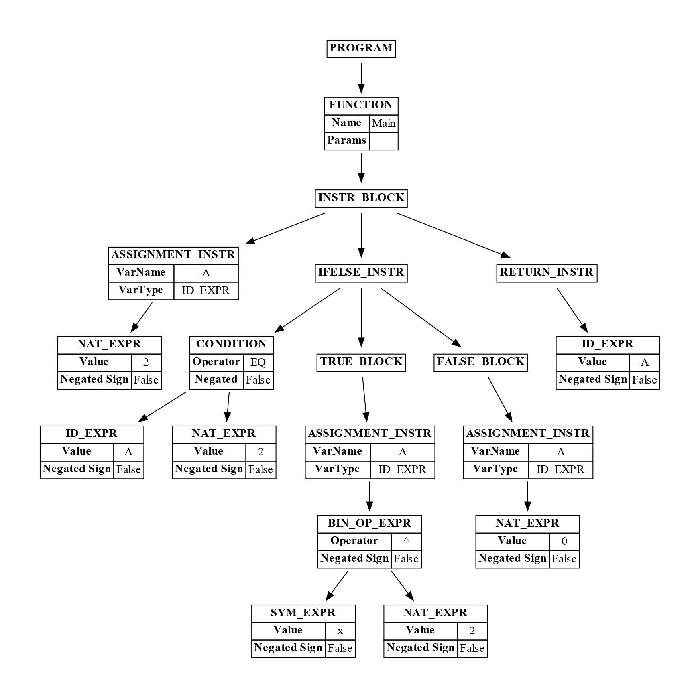

# LUPPOLO
Luppolo è un linguaggio di programmazione in grado di manipolare espressioni algebriche creato come progetto durante il corso Magistrale di Linguaggi e Traduttori dell'Università degli Studi di Milano. La traccia completa dello stesso può essere trovata al seguente [link](https://github.com/let-unimi/progetti/blob/master/05-Luppolo/Testo.md).<br>

<p align="center">
  
</p>


## INDICE
1. [STRUTTURA DEL PROGETTO](#struttura-del-progetto)
2. [DIPENDENZE](#dipendenze)
3. [GUIDA ALL'UTILIZZO](#guida-allutilizzo)
    - [Compilazione della grammatica](#compilazione-della-grammatica)
    - [Esecuzione dell'interprete](#esecuzione-dellinterprete)
    - [Esecuzione dei test](#esecuzione-dei-test)
4. [RAPPRESENTAZIONE](#rappresentazione)
    - [Formato testuale](#formato-testuale)
    - [Formato albero grafico](#formato-albero-grafico)
    - [Formato LaTeX](#formato-latex)
5. [FUNZIONI LIBRERIA](#funzioni-libreria)
6. [LUPPOLO TEST](#luppolo-test)
    - [Grammar](#grammar)
    - [Interpreter](#interpreter)
    - [Ast](#ast)
    - [How To](#how-to)

<br>

## STRUTTURA DEL PROGETTO
Tutti i file sorgente possono essere trovati all'interno della cartella `src`. <br>
Essi sono suddivisi rispettivamente in `ast`, che contiene la definizione degli alberi sintattici astratti, `grammar`, che contiene la grammatica del linguaggio, `interpreter`, che contiene l'interprete del linguaggio e `utils`, che contiene una serie di classi di utilità.<br>
Oltre a `src` è anche presente la cartella `test`, che contiene i test del progetto. <br>

### AST
L'ast rappresenta l'albero astratto del linguaggio, ovvero una semplificazione dell'albero sintattico originale generato dal parser in fase di parsing del codice. <br>
La generazione dell'AST avviene attraverso la classe [AstGenerator](src/ast/AstGenerator.py) che utilizzando un visitor, visita l'albero sintattico generato dal parser e produce per ogni nodo le corrispettive astrazioni che possono essere trovate all'interno della directory [elements](src/ast/elements).

### EXPRESSION
Le espressioni sono le unità fondamentali del linguaggio, e sono rappresentate all'interno della cartella [expression](src/expression). <br>
Sono utilizzate per la rappresentazione di espressioni algebriche e possono essere suddivise in [nodes](src/expression/nodes.py), che rappresentano gli operatori di somma, prodotto e potenza, e [leaf](src/expression/leaf.py), che sono i numeri razionali e i simboli.

### GRAMMAR
Contiene la definizione della [grammatica](src/grammar/syntax/luppolo.g) del linguaggio Luppolo. <br>
E' presente inoltre la classe [AntlrGrammarCompiler](src/grammar/AntlrGrammarCompiler.py) che permette di compilare la grammatica in modo automatico. Vedi sezione [compilazione automatica](#compilazione-automatica) per ulteriori informazioni.<br>
In [LuppoloGrammar](src/grammar/LuppoloGrammar.py) è presente invece la definizione di tutti gli elementi utili per interagire con la grammatica.

### INTERPRETER
Contiente l'[interprete](src/interpreter/interpreter.py) del linguaggio, che permette di eseguire il codice scritto in Luppolo. <br>
L'interprete è un interprete iterativo che permette di interpretare funzioni e per ognuna di esse possiede una memoria delle variabili, uno stack delle istruzioni e uno stack dei valori computati.

### UTILS
Contiente alcuni elementi utilizzati durante lo sviluppo del progetto, come la classe [LuppoloLogger](src/utils/LuppoloLogger.py) che permette di loggare messaggi in maniera strutturata, e le classi [GenericTreeNode](src/utils/GenericTreeNode.py), che rappresenta un generico nodo con i relativi figli per strutturare una gerarchia di nodi, e [GraphTreeNode](src/utils/GraphTreeNode.py), che permette la rappresentazione grafica di un nodo.<br>
La classe [Converter](src/utils/Converter.py) permette di convertire qualsiasi espressione della grammatica in un'opportuna espressione dell'AST (utile per passare i parametri nell'interpretezione delle funzioni).<br>
Infine la classe [ExprToPdf](src/utils/ExprToPdf.py) permette la generazione di un file pdf contenente tutte le rappresentazioni di una espressione algebrica data la stessa e di poter inoltre generare la rappresentazione grafica PDF di un qualsiasi `GenericTreeNode`.

<br><br>

## DIPENDENZE
- **PYTHON 3.10.11**<br>
  Il progetto è stato sviluppato utilizzando Python 3.10.11. Se non si possiede Python è possibile scaricarlo dal [sito ufficiale](https://www.python.org/downloads/).<br>

- **ANTLR4 (V4.13.2)**<br>
  Il progetto utilizza ANTLR4 per la generazione del Lexer e del Parser. Per installare ANTLR4 è possibile seguire la guida ufficiale disponibile al seguente [link](https://www.antlr.org/download.html).<br>
  Si consiglia di impostare `%ANTLR4_JAR%` come variabile d'ambiente contenente il path del jar di antlr4, altrimenti è necessario specificare il path del jar di antlr4 in fase di compilazione della grammatica. Vedi sezione [guida all'utilizzo](#guida-allutilizzo) per ulteriori informazioni.<br>

- **TEX DISTRIBUTION** (Opzionale)<br>
  Se si vuole sfruttare la generazione del PDF contenente il risultato del programma, è necessario avere una distribuzione di TEX installata che permetta il comando `pdflatex`. <br>
  Durante lo sviluppo è stato utilizzato [MikTex](https://miktex.org/).

<br><br>

## GUIDA ALL'UTILIZZO
Luppolo mette a disposizione 3 funzionalità principali:
- [Compilazione della grammatica](#compilazione-della-grammatica)
- [Esecuzione dell'interprete](#esecuzione-dellinterprete)
- [Esecuzione dei test](#esecuzione-dei-test)

**ATTENZIONE:** Prima di iniziare ad utilizzare LUPPOLO è necessario compilare la grammatica, che non viene fornita precompilata.<br>

### COMPILAZIONE DELLA GRAMMATICA
La compilazione della grammatica può essere effettuata o manualmente o automaticamente. La sua compilazione permette la generazione all'interno della cartella bin del `Lexer`, del `Parser`, del `Listener` e del `Visitor`, sui quali è basato il resto del funzionamento del progetto. 
#### Compilazione automatica
Per la compilazione automatica viene messa a disposizione la classe AntlrGrammarCompiler, che permette di compilare la grammatica in modo automatico.<br>
Per avviare la compilazione basta eseguire il metodo `compileGrammar()` della classe `AntlrGrammarCompiler`. Vedere la documentazione del metodo per ulteriori informazioni sui parametri.<br>
<br>
E' possibile inoltre compilare la grammatima direttamente da linea di comando eseguendo il comando: 
```bash
python -m src.main compile
```
Per approfondimenti vedere la guida aggiungendo `--help` alla fine del comando.

#### Compilazione manuale
Per la compilazione manuale è necessario utilizzare il jar di antlr4 attraverso il comando:
```bash
java -jar [YOUR ANTLR_JAR] -Dlanguage=Python3 -visitor -o ../bin/ src/grammar/syntax/luppolo.g
```
oppure:
```bash
cd src
antlr4 -Dlanguage=Python3 -visitor -o ../bin/ src/grammar/syntax/luppolo.g
```

<br>

### ESECUZIONE DELL'INTERPRETE
**ATTENZIONE**: L'esecuzione dell'interprete è subordinata alla compilazione della grammatica. 
<br><br>
Il file sorgente che deve essere interpretato deve avere l'estensione `.lp` e deve essere passato come primo argomento quando viene eseguito l'interprete. <br>
Oltre al file sorgente è possibile specificare (se necessario) i parametri in formato stringa che verranno passati alla funzione principale del programma. Questi possono essere semplici valori numerici così come valori più complessi tipo espressioni algebriche, funzioni definite nello stesso sorgente o funzioni di libreria. Essi verranno infatti interpretati nel momento dell'esecuzione dell'interprete.


Di default il comando produce un file pdf contenente l'espressione risultante dall'interpretazione del programma e questa viene fornita sotto forma di albero, in formato LaTeX e in formato testuale. Vedi la sezione [Rappresentazione](#rappresentazione) per ulteriori informazioni.<br><br>
Per eseguire l'interprete è possibile utilizzare il comando `run` come segue:
```bash
python3 -m src.main run ./path/to/sorgente/sorgente.lp [param1] [param2] ...
```

Il comando mette a disposizioni una serie di opzioni che permettono ad esempio di specificare la funzione principale, di scegliere il formato del file pdf generato,  di scegliere il tipo di output da dare in console, di specificare il livello di logging e altro.<br>
Per tutte le opzioni disponibili è possibile aggiungere `--help` alla fine del comando per avere ulteriori informazioni.

<br>

### ESECUZIONE DEI TEST
Per eseguire i test è possibile utilizzare il comando `test` come segue:
```bash
python -m src.main test
```
Il comando mette a disposizioni una serie di opzioni che possono essere consultate aggiungendo `--help` alla fine del comando.

<br><br>


## RAPPRESENTAZIONE
All'interno di Luppolo è stata data la possibilità di rappresentare sia le espressioni algebriche che i nodi dell'AST in molteplici formati. <br>
- [`FORMATO TESTUALE`](#formato-testuale) 
- [`ALBERI GRAFICI`](#formato-albero-grafico) generati come PDF
- [`FORMATO LATEX`](#formato-latex) (solo per le espressioni algebriche)


### FORMATO TESTUALE
Il formato testuale è la rappresentazione più semplice e consiste in una stringa che rappresenta la struttura dell'albero dell'AST o dell'espressione. <br>
Essa può essere ottenuta utilizzando il metodo `Trees.toStringTree(par)` di antlr4, e come parametro può essere passato sia l'AST che una espressione.<br> 
Un esempio di `rappresentazione testuale dell'AST` è il seguente:
```
(P (F (BLK (A 2) (IFEL (EQ A 2) (BLK (A (POW x 2))) (BLK (A 0))) (RET A))))
```
Un esempio di `rappresentazione testuale di un'espressione` è il seguente:
```
(S (M 3 x) (P x 1/2) (P x 3))
```

### FORMATO ALBERO GRAFICO
Questo tipo di formato permette di ottenere una semplice rappresentazione grafica dell'albero dell'AST o dell'espressione. <br>
Per ottenere un albero grafico è possibile utilizzare la classe `GraphTreeNode` che permette di generare un albero grafico a partire dall'AST o da una espressione. <br>

Un esempio di `albero grafico dell'AST` è il seguente:
<p align="center">
  
</p>

Un esempio di `albero grafico di un'espressione` è il seguente:

<p align="center">
  
</p>

### FORMATO LATEX
Il formato LaTeX permette di ottenere una rappresentazione in formato LaTeX dell'espressione algebrica. <br>
Per ottenere una rappresentazione in formato LaTeX è possibile utilizzare il metodo `getLatexRapresentation()` fornito da tutti gli elementi che rappresentano un'espressione algebrica.<br>

Un esempio di `rappresentazione LaTeX di un'espressione` è il seguente:
```
'3\\cdot x+\\sqrt{x}+x^{3}'
```
In formato LaTeX:
<p align="center">
  
</p>

<br>

## FUNZIONI LIBRERIA
In Luppolo sono state sviluppate 5 funzioni di libreria che possono essere utilizzate all'interno del codice sorgente. <br>
Le funzioni di libreria sono le seguenti:
- `Expand` : Espande un'espressione algebrica
- `Substitute` : Sostituisce tutte le sottoespressioni di un'espressione algebrica con un'altra espressione algebrica
- `Eval` : Valuta un'espressione algebrica sostituendo il simbolo nell'espressione con il valore dato
- `SimpleDerive` : Calcola la derivata di un'espressione algebrica rispetto ad una variabile
- `DerivePolynomial` : Calcola la derivata di un polinomio univariato dopo averlo espanso

<br>

## LUPPOLO TEST
In questo progetto sono stati forniti dei test di base che permettono di verificare il corretto funzionamento del linguaggio. <br>
I test non devono essere intesi come esaustivi e non seguono nessun tipo di specifica formale quale unit test o integration test o analoghi, ma sono stati creati per verificare il corretto funzionamento del linguaggio durante lo sviluppo.<br><br>
Sono state create molteplici cartelle con dentro i corrispettivi test (spiegati di seguito) e sono stati divisi in due categorie: `valid` e `erroneous`. <br>
I test `valid` sono test che dovrebbero essere accettati dal linguaggio, mentre i test `erroneous` sono test che dovrebbero essere rifiutati.<br>

**NOTA**: Alcuni test sono subordinati alla correttezza di altri costrutti sintattici, altrimenti sarebbero rifiutati a prescindere dalla grammatica.<br>
Es: In grammar _Id è subordinato alla correttezza di function(vedi [emptyFunc](grammar/valid/function/emptyFunc.lp)), poichè il funzionamento è stato testato nella dichiarazione di funzione._

Per l'esecuzione dei test è possibile utilizzare il comando `test` come spiegato nella sezione [Esecuzione dei test](#esecuzione-dei-test).

### GRAMMAR
All'interno della folder [grammar](test/grammar) sono presenti alcune batterie di test per la grammatica del linguaggio. <br>
Sono stati testati tutti i costrutti sintattici del linguaggio e per ognuno di essi sono stati sono stati creati dei test che permettono di provare le varie configurazioni che devono essere rispettate.

### INTERPRETER
All'interno di [interpreter](test/interpreter) sono presenti dei test che permettono di verificare il corretto funzionamento dell'interprete. <br>

### AST
All'interno di [ast](test/ast) sono presenti dei test che permettono di verificare il corretto funzionamento della generazione dell'AST. Questi non sono divisi tra `valid` e `erroneous` poichè non è possibile generare un AST da un codice errato.<br>
Questi test richiedono di essere eseguiti a mano e verificare dunque che l'AST prodotto rispecchi quanto atteso.